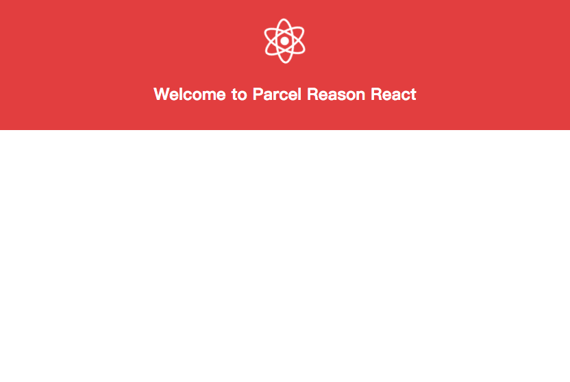

# Parcel Reason React App

> A simple reason react app using parcel bundler

<p align="center">
  <a href="https://parcel-reason.netlify.com/" target="_blank">
    
    <br />
    Live Demo
  </a>
</p>

## Getting Started

```bash
git clone https://github.com/Raincal/parcel-reason-react-app.git
cd parcel-reason-react-app
yarn
yarn start
```

Then open http://localhost:1234/ in your browser.

## Build for production

```bash
yarn build
```

## Deployment

See the section about deployment in [create-react-app](https://github.com/facebookincubator/create-react-app/blob/master/packages/react-scripts/template/README.md#deployment)

## License

[MIT](./LICENSE)
